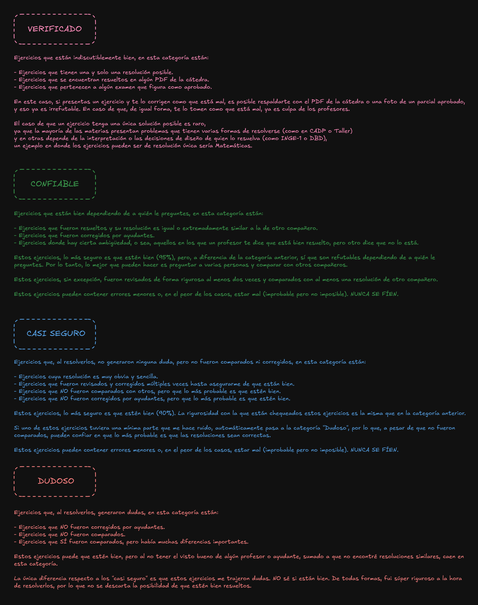

___

# Diseño de Bases de Datos

___

### IMPORTANTE
- **_EN LO POSIBLE LEAN TODO EL README, HAY ANOTACIONES IMPORTANTES_**  
- **_Utilicen los ejercicios únicamente para comparar resultados_**. Si bien las resoluciones pueden ser correctas, **_nunca se fíen_**. El criterio que usa la cátedra es algo ambiguo a veces: **_algún ayudante te puede decir que algo está bien y otro te puede decir lo contrario_**. Por lo tanto, la mejor manera de saber si las cosas están bien es consultar, comparar con otros compañeros y practicar mucho.  
- También tengan en cuenta que **_algunas cosas puntuales tienen varias formas de resolverse_**, ya que son decisiones de diseño y estas dependen de lo que el desarrollador crea más conveniente. Por eso, es muy importante aprender a identificar qué partes del modelo deben modelarse de una forma concreta (como los historiales) y qué partes pueden variar dependiendo del criterio de cada uno (como elegir un atributo vs. una entidad).  

___

### CRITERIOS DE CORRECCIÓN  
- En los ejercicios y parciales van a encontrar las siguientes etiquetas, estas **_indican el nivel de confianza que pueden tener sobre el ejercicio_**.  
- Esto es tan solo una referencia, independientemente de la etiqueta que vean, **_NUNCA SE FÍEN_**. Recuerden preguntar todo lo que puedan y comparar resultados con sus compañeros.  

___

### Otros Repositorios
si les son de utilidad dejen sus estrellitas

- https://github.com/ssofiaavila/DBD--Informatica-UNLP
- https://github.com/agusrnfr/DBD
- https://github.com/Fabian-Martinez-Rincon/DBD
- https://github.com/Giancardonee/DBD
- https://github.com/felipemassera/DisenoBasesDatos
- https://github.com/alexisarte/DBD

___

### Recursos Útiles  

- [**Youtube - Clases de Teoría Grabadas**](https://youtube.com/playlist?list=PLgjP77yaDcE-t44Lfz5bGlSzHf63Od5uF&si=GM05u3dkkfIYh585)  
- [**Youtube - Ejemplos de la Teoría (suban el volumen)**](https://www.youtube.com/watch?v=YCI-FgcKAu4&list=PLAsNmuq7oIjrLFTa6fvfl-rL6uUB_cXYX)  
- [**Drive - Powerpoints con Audios y Ejemplos de Teoría**](https://drive.google.com/drive/u/0/folders/1_HfE-FjhlwMInBQoSAdSqrKD944sVSvj)  
- [**Drive - Explicaciones de Práctica**](https://drive.google.com/drive/u/0/folders/1g1bf1qewCKMTaXkAwk8eooq1tGH4CVuN)  
- [**Drive Definitivo - Todo el material necesario para aprobar DBD**](https://drive.google.com/drive/folders/1trqxBtQkptaSapz-A_7PgYd8B8gliZaq?usp=drive_link)  

___

### Práctica 1 - Introducción al Modelado Conceptual
- Todos los ejercicios fueron revisados por un profesor.  
- Todos los ejercicios fueron comparados con otro repositorio y con resoluciones que pasaron al grupo de WhatsApp.  

[**_Enunciados de la práctica 1_**](Practicas/.enunciados/DBD-2024%20-%20Práctica%201%20-%20Introducción%20al%20Modelado%20Conceptual.pdf)

* [**ejercicio 01**](Practicas/Practica%201/ejercicio%2001/ejercicio_01.png)
* [**ejercicio 02**](Practicas/Practica%201/ejercicio%2002/ejercicio_02.png)
* [**ejercicio 03**](Practicas/Practica%201/ejercicio%2003/ejercicio_03.png)
* [**ejercicio 04**](Practicas/Practica%201/ejercicio%2004/ejercicio_04.png)
* [**ejercicio 05**](Practicas/Practica%201/ejercicio%2005/ejercicio_05.png)
* [**ejercicio 06**](Practicas/Practica%201/ejercicio%2006/ejercicio_06.png)
* [**ejercicio 07**](Practicas/Practica%201/ejercicio%2007/ejercicio_07.png)
* [**ejercicio 08**](Practicas/Practica%201/ejercicio%2008/ejercicio_08.png)
* [**ejercicio 09**](Practicas/Practica%201/ejercicio%2009/ejercicio_09.png)

___

### Práctica 2 - Modelado conceptual, lógico y fisico
- La parte 1 es, con diferencia, la más compleja de todas las prácticas y la que más se presta a errores. Por lo tanto, aunque fui súper riguroso y comparé de todas las fuentes posibles, les recomiendo encarecidamente que **CONSULTEN TODOS LOS EJERCICIOS SIN EXCEPCIÓN**.  
- Todos los ejercicios de la parte 1, exceptuando el 12 y el 13, fueron comparados con otros repositorios.  
- Todos los ejercicios de la parte 2 fueron corregidos por un ayudante.  

[**_Enunciados de la práctica 2_**](Practicas/.enunciados/DBD-2024%20-%20Práctica%202%20-%20Modelado%20conceptual%2C%20logico%20y%20fisico.pdf)

#### Parte 1
* [**ejercicio 01**](Practicas/Practica%202/parte%201/ejercicio%2001/ejercicio_01.png)
* [**ejercicio 02**](Practicas/Practica%202/parte%201/ejercicio%2002/ejercicio_02.png)
* [**ejercicio 03**](Practicas/Practica%202/parte%201/ejercicio%2003/ejercicio_03.png)
* [**ejercicio 04**](Practicas/Practica%202/parte%201/ejercicio%2004/ejercicio_04.png)
* [**ejercicio 05**](Practicas/Practica%202/parte%201/ejercicio%2005/ejercicio_05.png)
* [**ejercicio 06**](Practicas/Practica%202/parte%201/ejercicio%2006/ejercicio_06.png)
* [**ejercicio 07**](Practicas/Practica%202/parte%201/ejercicio%2007/ejercicio_07.png)
* [**ejercicio 08**](Practicas/Practica%202/parte%201/ejercicio%2008/ejercicio_08.png)
* [**ejercicio 09**](Practicas/Practica%202/parte%201/ejercicio%2009/ejercicio_09.png)
* [**ejercicio 10**](Practicas/Practica%202/parte%201/ejercicio%2010/ejercicio_10.png)
* [**ejercicio 11**](Practicas/Practica%202/parte%201/ejercicio%2011/ejercicio_11.png)
* [**ejercicio 12**](Practicas/Practica%202/parte%201/ejercicio%2012/ejercicio_12.png)
#### Parte 2
* [**ejercicio 01**](Practicas/Practica%202/parte%202/ejercicio%2001/ejercicio_01.png)
* [**ejercicio 02**](Practicas/Practica%202/parte%202/ejercicio%2002/ejercicio_02.png)
* [**ejercicio 03**](Practicas/Practica%202/parte%202/ejercicio%2003/ejercicio_03.png)
* [**ejercicio 04**](Practicas/Practica%202/parte%202/ejercicio%2004/ejercicio_04.png)
* [**ejercicio 05**](Practicas/Practica%202/parte%202/ejercicio%2005/ejercicio_05.png)
* [**ejercicio 06**](Practicas/Practica%202/parte%202/ejercicio%2006/ejercicio_06.png)
* [**ejercicio 07**](Practicas/Practica%202/parte%202/ejercicio%2007/ejercicio_07.png)

___

### Práctica 3 - Algebra relacional
- Como ningún profesor se va a sentar a corroborar los 80 puntos de la práctica, claramente no están corregidos, pero estoy un **99% seguro de que están bien**.  
- Corregí la práctica un total de 3 veces, punto por punto; estuve horas verificando que todo esté bien.  
- Todos y cada uno de los 80 puntos fueron resueltos de forma súper rigurosa.
- Todos y cada uno de los 80 puntos fueron comparados con otro repositorio y las resoluciones son prácticamente idénticas.  

[**_Enunciados de la práctica 3_**](Practicas/.enunciados/DBD-2024%20-%20Práctica%203%20-%20Algebra%20relacional.pdf)

* [**ejercicio 01**](Practicas/Practica%203/ejercicio%2001/ejercicio_01.png)
* [**ejercicio 02**](Practicas/Practica%203/ejercicio%2002/ejercicio_02.png)
* [**ejercicio 03**](Practicas/Practica%203/ejercicio%2003/ejercicio_03.png)
* [**ejercicio 04**](Practicas/Practica%203/ejercicio%2004/ejercicio_04.png)
* [**ejercicio 05**](Practicas/Practica%203/ejercicio%2005/ejercicio_05.png)
* [**ejercicio 06**](Practicas/Practica%203/ejercicio%2006/ejercicio_06.png)
* [**ejercicio 07**](Practicas/Practica%203/ejercicio%2007/ejercicio_07.png)
* [**ejercicio 08**](Practicas/Practica%203/ejercicio%2008/ejercicio_08.png)
* [**ejercicio 09**](Practicas/Practica%203/ejercicio%2009/ejercicio_09.png)

___

### Práctica 4 - SQL
- Como ningún profesor se va a sentar a corroborar los 113 puntos de la práctica, claramente no están corregidos, pero estoy un **99% seguro de que están bien**.  
- Todos y cada uno de los 113 puntos fueron resueltos de forma súper rigurosa.  
- Todos y cada uno de los 113 puntos fueron comparados con otros 2 repositorios y las resoluciónes coinsiden en un 95%.
- Todos y cada uno de los 113 puntos únicamente usan instrucciones SQL que nos explicaron en la Teoría y la Práctica; no hay nada de más.  
- Todos y cada uno de los 113 puntos fueron verificados con ChatGPT (me hizo correcciones menores y me sugirió soluciones similares).  

[**_Enunciados de la práctica 4_**](Practicas/.enunciados/DBD-2024%20-%20Práctica%204%20-%20SQL.pdf)

* [**ejercicio 01**](Practicas/Practica%204/ejercicio_01.sql)
* [**ejercicio 02**](Practicas/Practica%204/ejercicio_02.sql)
* [**ejercicio 03**](Practicas/Practica%204/ejercicio_03.sql)
* [**ejercicio 04**](Practicas/Practica%204/ejercicio_04.sql)
* [**ejercicio 05**](Practicas/Practica%204/ejercicio_05.sql)
* [**ejercicio 06**](Practicas/Practica%204/ejercicio_06.sql)
* [**ejercicio 07**](Practicas/Practica%204/ejercicio_07.sql)
* [**ejercicio 08**](Practicas/Practica%204/ejercicio_08.sql)
* [**ejercicio 09**](Practicas/Practica%204/ejercicio_09.sql)
* [**ejercicio 10**](Practicas/Practica%204/ejercicio_10.sql)
* [**ejercicio 11**](Practicas/Practica%204/ejercicio_11.sql)
* [**ejercicio 12**](Practicas/Practica%204/ejercicio_12.sql)
* [**ejercicio 13**](Practicas/Practica%204/ejercicio_13.sql)

___
